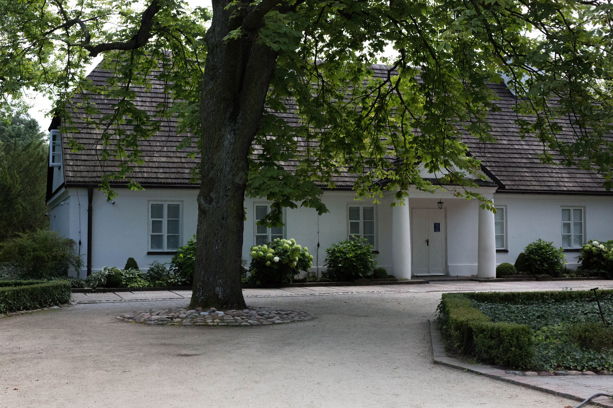
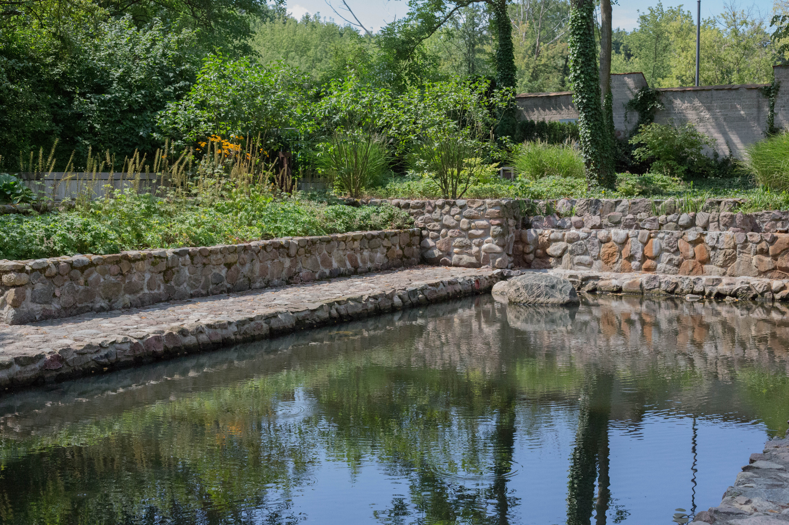
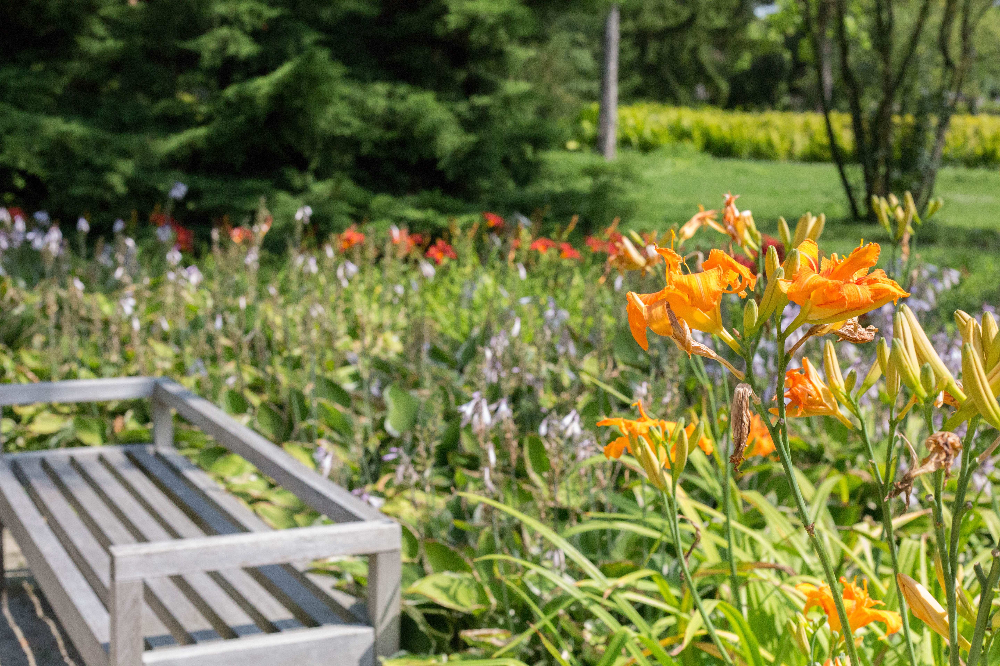
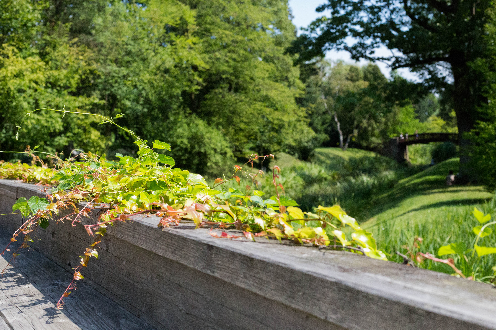

Chopin's Birthplace
=========

After a long bus ride from Józefów to Sochaczew, we arrived at the birthplace and early childhood home of Frédéric Chopin. 
He was born in 1810, and lived on the estate for only 6 months before his family moved to Warsaw.
The beautiful estate has been restored, though only the annex is as it was when the Chopins lived there.

<figure class="figure">
  
  <figcaption class="figure-caption text-right">The annex.</figcaption>
</figure>

The rest of the buildings have been added or completely rebuilt, and contain the exhibits relating to Chopin's life and works.
In the entry building, which has been rebuilt with modern Polish architecture, we watched a video describing the process of researching and constructing the estate.
There are some records of the estate layout, but the video explained the inconsistencies and how these affected the reconstruction for the museum.

After we saw the short film, we heard a live Chopin concert.
The seats by the annex (where the pianist was playing) were overfull, but the music was piped through speakers all over the estate gardens so we were able to walk around and enjoy the performance.

The estate is extraordinarily beautiful, though the earlier video suggests that a lot of the gardens are a thorougly modern addition.
The flowers, trees, and water works were a great accompaniment to the concert -- regardless of historical accuracy.

  

  

  

After the concert we walked through the Annex and looked at exhibits of the original furnishing (recreated,) the history of the estate and its rehabilitation, and the life and works of Chopin.
From his piano to his study, his life in Warsaw and Paris was recreated.
Though he only lived in the estate for 6 months, he and his family visited the family that lived on the estate until he was 20 and left Poland, never to return.