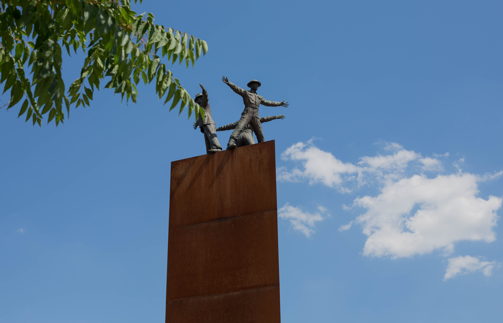
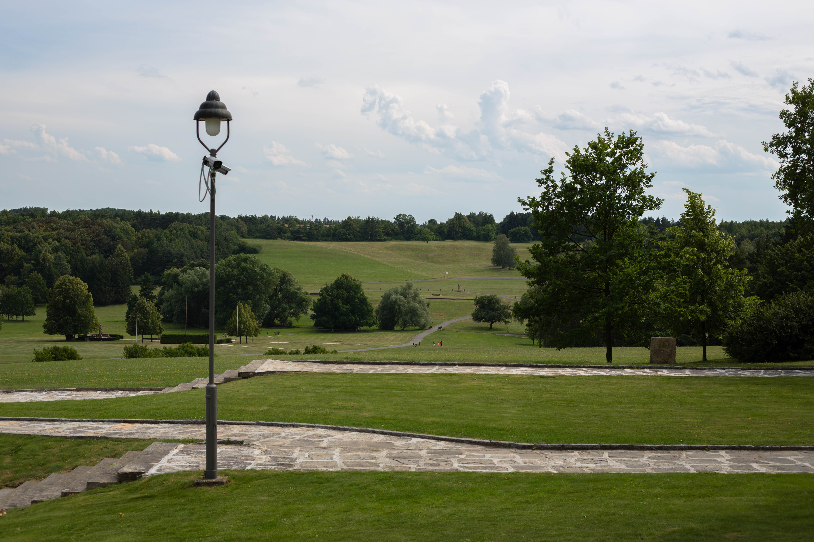
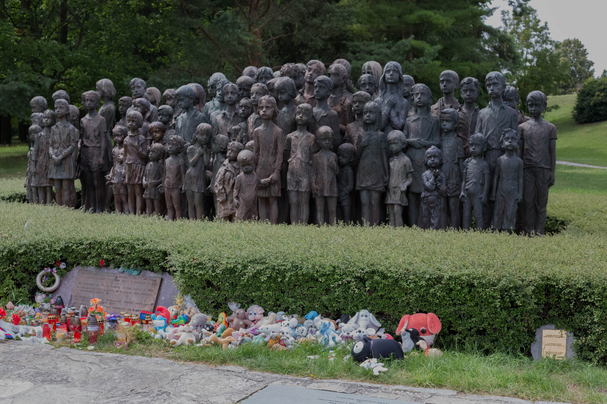
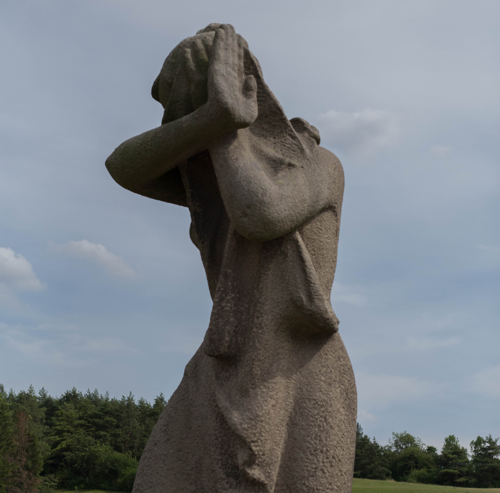
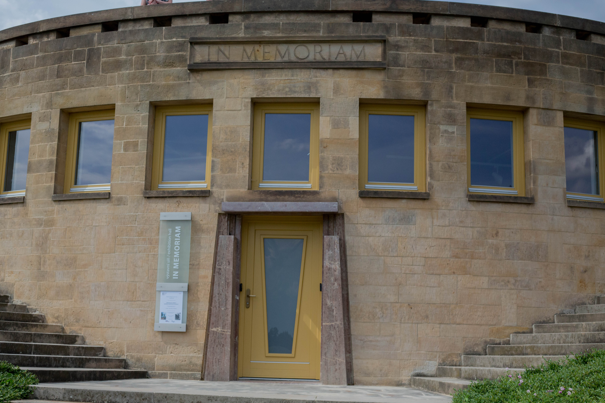

Lidice
===========

Today, we visited the memorial built on the remains of the Czech town of Lidice.
The town was destroyed in 1942, following the assassination of Reinhard Heydrich.
On the way to Lidice, we stopped at the site of Heydrich's assassination -- a bend in the road where three assassins waited for him to drive by in his open car.

Heydrich was very careless with his security, driving in a convertible instead of an armoured car. He had no car driving ahead of him, and only one gaurd accompanying him.
Despite the seemingly ripe pickings, the assassins had a bumblefuck of an operation.
Their gun jammed and the grenade they threw missed Heydrich and hit the car.
While Heydrich seemed uninjured (persuing the assassins on foot,) he was hit by schrapnel and died of an infection a week later. 

<figure class="figure">
  
  <figcaption class="figure-caption text-right">A monument to the three assassins.</figcaption>
</figure>

The reprisals committed by the Germans after the death of Heydrich were devasting to the Czech people.
The immediate response by the Nazis in Prague was to track down the assassins, torturing anyone they believed to be associated.
The two gunmen considered committing suicide to alleviate the reprisals, but they feared that the Germans would not be content with just the death of the assassins alone (and they turned out to be correct.)
The Nazi terror operation turned up the hiding place of the band of assassins -- 11 men hid out in the catacombs of a Prague church.
They held off the Germans while trying to tunnel out the back, but when it became clear that they wouldn't be able to get out before running out of ammunition the whole group committed suicide.

After the assassins and their collaborators were all killed or killed themselves to prevent capture, the Germans began reprisal operations on anyone with even the slightest suspected connection.
Even though all the assassins were now dead, the Gestapo and SS committed ruthless murders all over Czechoslovakia — over five thousand suspected resistance members were killed in these efforts.

The town of Lidice was thought to be a potential hotbed for resistance, and was completely devastated.
It's this town that we came to visit, and we walked through the fields that now stand where the town was.

<figure class="figure">
  
  <figcaption class="figure-caption text-right">A field on the former town of Lidice.</figcaption>
</figure>

When the Germans arrived in Lidice, they gathered the entire population of the town in the city center.
All men and boys over 15 were taken aside, then shot in front of their families.
The women were all taken to concentration camps, and most were dead by the end of the war.
A few children were selected for "Germanisation" and adopted by German families, the majority sent to concentration camps or gassed in vans before they even arrived.

<figure class="figure">
  
  <figcaption class="figure-caption text-right">A statue of the children of Lidice.</figcaption>
</figure>

<figure class="figure">
  
  <figcaption class="figure-caption text-right">A statue of a woman from Lidice.</figcaption>
</figure>

After a walk around the memorial, we went into the museum.
First we watched a video with a few clips of video taken when the town was still standing.
The video recounted the massacre and arrests that took place, and the damage done to the town.
Looking at the photos and video of the town before, and then seeing the photos taken by Germans after the destruction was very moving.

<figure class="figure">
  
</figure>

We went into the exhibit hall of the museum (no pictures allowed) located behind the movie screening room.
The few remaining artifacts of the town are preserved here: the metal church door, a road sign damaged beyond readability, a few personal items left in the ruins.

There were also video clips playing of the survivors, recounting their stories and the stories of their families.
Some of these survivors are still alive, the very youngest of the children.

Photos of the residents were on the walls, showing them living happily before the war.
The last group of school-children posed for a photo in front of the school.
Photos of the assassins were also shown; side by side photos of each man dead and alive.
