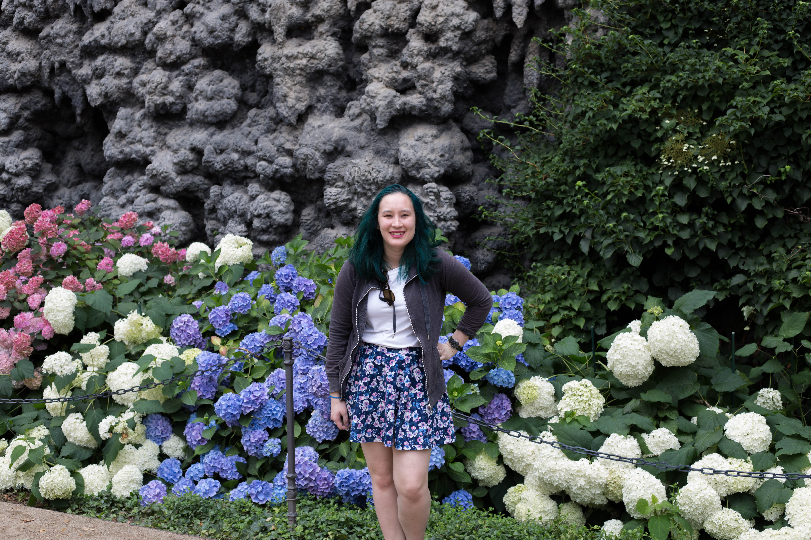

Prague Scavenger Hunt
=========

My scavenger hunt group scoured the city all day Wednesday for the 10 sites required for the contest. 
We were luck enough to already have a picture the _astronomical clock_ and _"dancing house"_ from earlier tours, as well as the _Lennon wall_ from an evening walk around the city yesterday.

The first location that the group visited was the graveyard near our hotel, where the Czech hero Jan Palach is buried. 
We had a hard time locating the grave, but after asking for directions several times we found the spot. 
The grave doesn't stick out from its neighbors -- it is quite plain and has no stone headstone, just photos and a paper sign placed on the stone.

Next we hopped on a train to old town, to grab a photo of the _grotto wall_ in the Senate gardens. We found the wall quickly, then walked around the gardens, enjoying the statues and peacocks.

<figure class="figure">
  
  <figcaption class="figure-caption text-right">Me, in front of the grotto wall</figcaption>
</figure>

<figure class="figure">
  
  <figcaption class="figure-caption text-right">Me, with a peacock</figcaption>
</figure>

After the gardens and grotto wall, we walked to the _old Jewish cemetery_.
This cemetery happens to be the final resting place of Franz Kafka.
While some of the group went on a tour of the cemetery, I went ahead to the _statue of Franz Kafka_.
The surreal statue seemed a good fit for the author, whose books are very mind-bending.

<figure class="figure">
  
  <figcaption class="figure-caption text-right">Me, in front of the Kafka statue</figcaption>
</figure>

After lunch, I met up with the rest of the group and we went to track down another Kafka statue: this time, just his head.
We had a lot of trouble finding the _Kafka head statue_. 
Despite having a photo to show, we couldn't find anyone off the street who had heard of it.
Finally, we realized that we had the spot marked wrong on the map, and found it a few blocks away.
The head was enourmous and hard to identify as a head at all from several angles.

Once we had finished off the assigned stops, we finished the afternoon with an hour paddle-boating on the Vltava river.