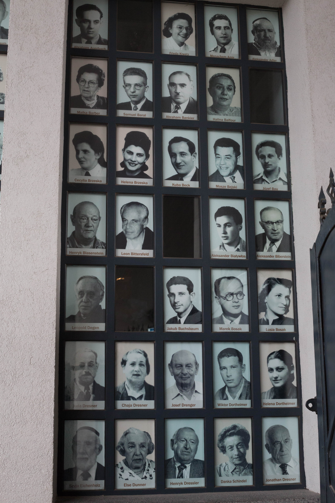
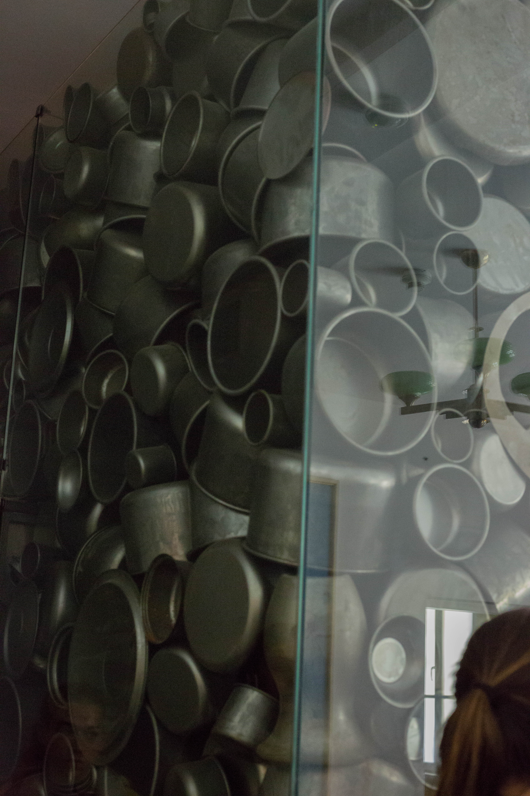

The Museum at the Schindler Factory
=========

The museum that now lives at the former administrative headquarters of Schindler's Factory is not dedicated to Schindler (whose story is told in the Film _Schindler's List_) -- it focuses on the Second World War in Krakow and throughout Poland.
We got off our bus and waited by the gates to the factory, and the wall of windows with photos of the men and women saved by Oskar Schindler.

<figure class="figure">
  
  <figcaption class="figure-caption text-right">Photos displayed in windows outside the musuem.</figcaption>
</figure>

The first small room contained photos of Krakow before WWII, of the city and its occupants.
The city looked for the most part the same as it does now, since Nazi forces used the city as a base of operations.

Another exhibit was designed to look like a train station, then the next a train car, and finally another train station.
This journey took us from the outbreak of fighting in Krakow to the German occupation of Poland.
We saw the German propaganda and posters used during the war in Germany and Poland.
There were also resistance propaganda, including a charicature of hitler only seen when the drawing of four pigs was folded a certain way.

The office that Shindler occupied when the factory was active marks the center of an exhibit on the operations of the factory.
The factory manufactured pots and pans, shown in a large display.

<figure class="figure">
  
  <figcaption class="figure-caption text-right">Pots made in the factory.</figcaption>
</figure>

At the end of the museum was a room of choices, with pillars and walls showing quotes of stories.
Some stories were those of heroes: people who chose to help others, to be human in the face of inhumanity.
Others were the stories of those who took advantage of the down and under.
The message was clear: in war and in peace, an individual's decisions matter.
