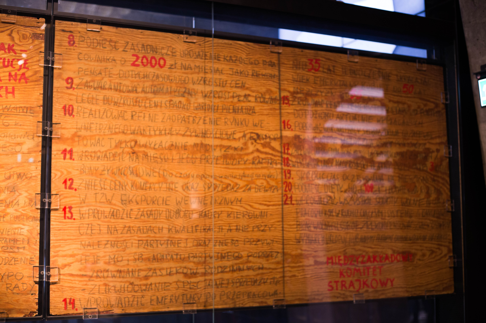
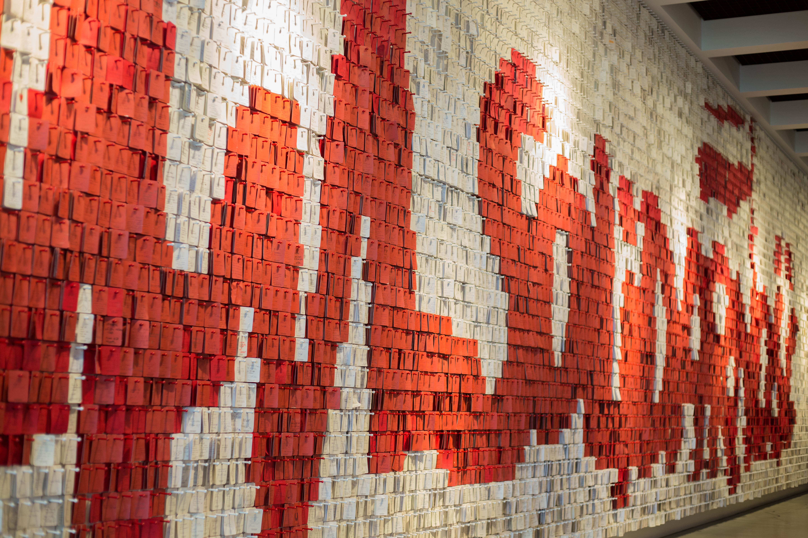
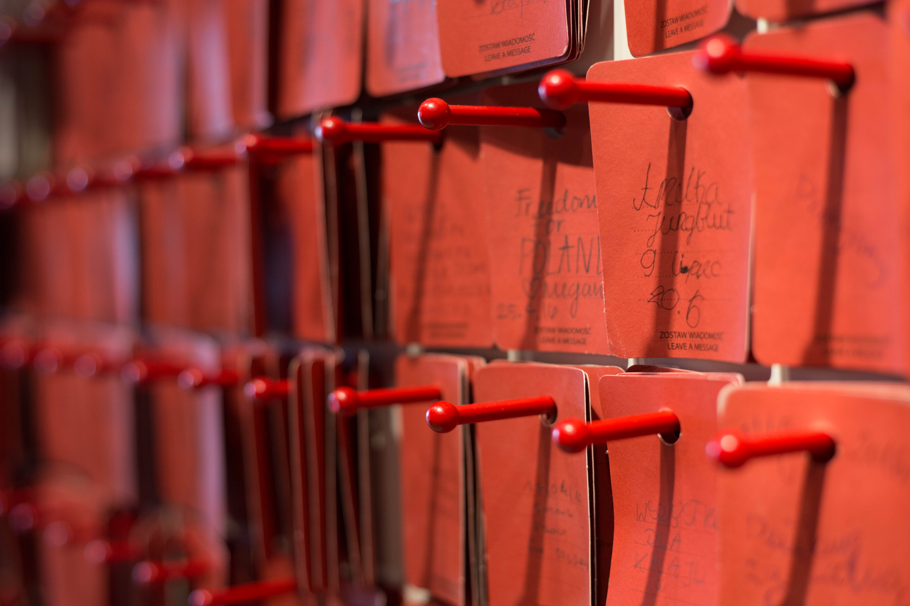

Solidarity Museum
===========

The Solidarity Museum exhibits live in a multi-functional building, home to libraries and conference centers used frequently for community and active events.
The architectural and material choices of the building give the image of a ship, fitting for the center which is built on the shipyard where the Solidarity movement was born.

The Solidarity exhibits were split into six halls, and the first was dedicated to the origins of the Solidarity museum.
Important relics from the shipyard were kept here, especially the original board containing the demands from the first Solidarity strike.

<figure class="figure">
	
	<figcaption class="figure-caption text-right">The demands.</figcaption>
</figure>

The next room contained information about other resistance and protests under Communism.
The Prague Spring and invasion of Czechoslovakia were documented here, along with protests that became violent in Gdynia where uninvolved commuters were shot dead.

An interesting room with a large mirror on the cieling showed the successes and failures of the Solidarity movement.
On the inside of the large white letters that spelled out Solidarity were the successes of the movement: the visits of the Pope, the international recognition of the movement.
The outside of the letters showed the failures and setbacks. The attempted assassination of the Pope is on this side, along with events of Martial Law in Poland.

The next hall focused on the fall of Communism throughout the former Soviet Bloc.
The Polish elections that put Solidarity leaders into the government marked the beginning of the end for Polish Communism.
A timeline showed the dominoes of Communism falling over to democracy.

At the far end of this hall, was a large wall that spelled out Solidarity with red and white notecards pinned to the wall.
Visitors from all over the world left their notes in support of Poland, the Solidarity movement, and peace in general.

	<figure class="figure">
		
		<figcaption class="figure-caption text-right">The visitor wall.</figcaption>
	</figure>

	<figure class="figure">
		
	</figure>

Down the stairs from the last exhibit hall was a room with an outlook onto the monument to those killed in 1970, built as part of the first strike's agreement.
Three crosses mark the site, a tribute to the Catholic spirit of the Polish people in spite of Communism.
On this spot Pope John Paul II gave an address to the Polish people, widely considered as a crucial motivator to the continuing movement for freedom.

