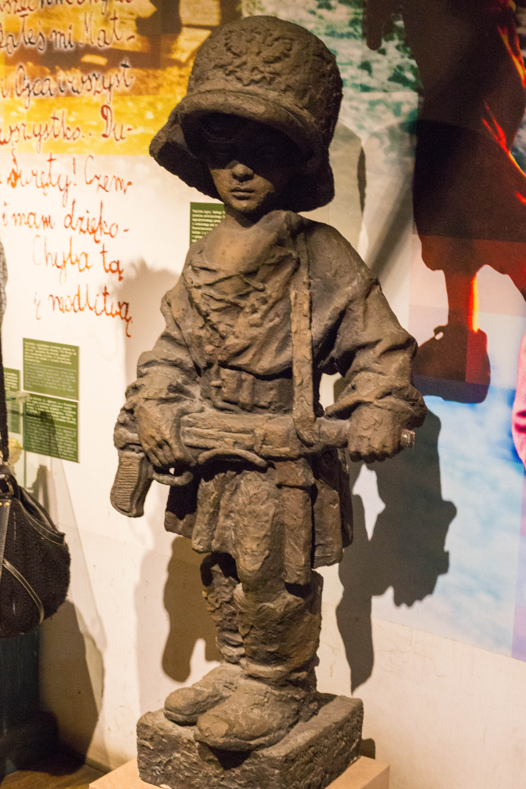
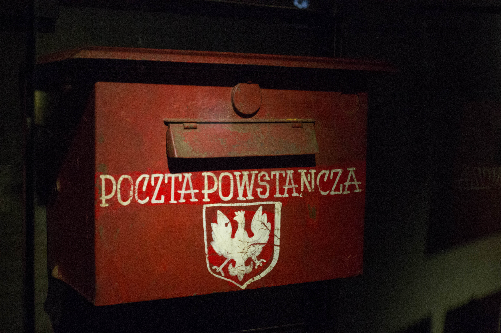

Warsaw Uprising Museum Tour
=========

The Warsaw Uprising Museum was amazingly informative and engaging. 
Before we arrived, I felt like I had heard everything possible about the events of the Uprising, but I learned a lot from both our fantastic tour guide and the exhibits themselves.

As soon as we entered the museum, we heard the bassy sound of a heartbeat -- 63 times a minute for the 63 days of the fighting.
The entry space contained maps and photos that helped me understand the geography of the uprising timeline.
There were also photos of various aspects of daily life during the uprising, both of combatants and civilians.
A room just off this space that we didn't go through but I stepped inside briefly was _The Room of the Little Insurgent_.
This room contained a statue of a young child soldier, as well as photos and toys.

<figure class="figure">
  
  <figcaption class="figure-caption text-right">The Little Insurgent.</figcaption>
</figure>

We went through replicas of the sewers that were used in the uprising by insurgents to secretly move through the city. 
I'm not that tall, but it was hard for me to fit through the tight spaces.
Without lights or maps, it's easy to see how people got lost.

The tent exhibit of the post-mortem examinations, though only papers, was very moving.
The documents showed both the brutality of German slaughters as well as the amount of unidentified dead.
Our tour guide said that most of the named dead were identified from bottles that were buried next to them with whatever information was available.

Outside of the tent was a small display of medical units, but our guide added quite a bit of information.
Support units were comprised of primarily women and children, though women also fought as combatants.

We also saw an exhibit of the postal system used by insurgents and run by children as young as 10 (though 13 was the offical age requirement.)
Special mailboxes were set up for the insurgents to communicate, and though letters were restricted to one a day (then eventually 10 words) post workers delivered thousands of letters a day.
Letters were also checked for possible compromising information (such as the locations of bases or hospitals) and censored.

<figure class="figure">
  
  <figcaption class="figure-caption text-right">Insurgents' Post Box.</figcaption>
</figure>

Finally we saw a short 3d film showing a recreated view of the destruction after the uprising.
As we learned in class and then saw again throughout the museum, the city was devastated and most of the infrastructure razed.

The museum was a very eye-opening experience, and I'm glad that I got to experience an immersive story re-telling the events of the uprising from many perspectives.

<figure class="figure">
  
  <figcaption class="figure-caption text-right">Flowers and a lantern placed on the memorial.</figcaption>
</figure>

