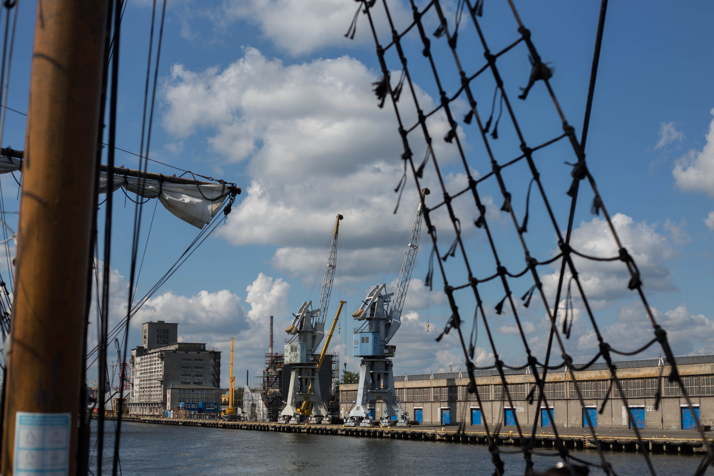
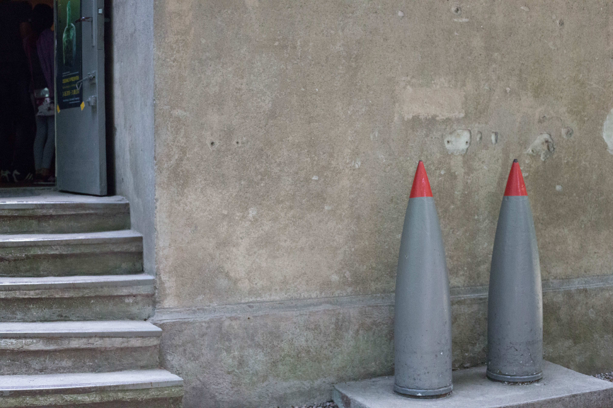
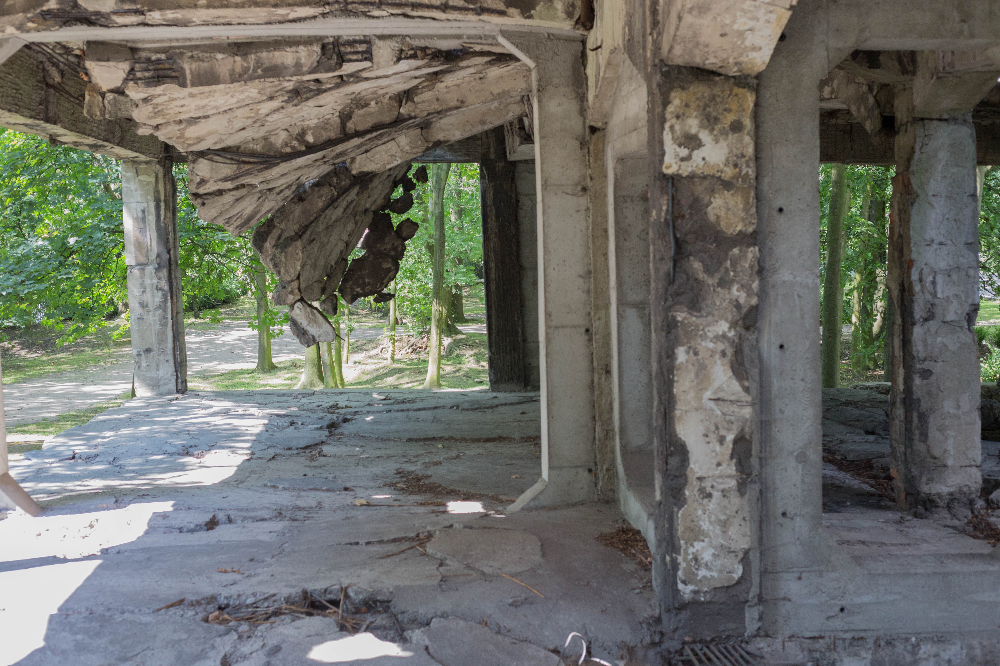

Westerplatte Tour
==========

This morning we hopped on a pirate ship to Westerplatte to see the site of the first shots of World War Two. 
The ship took us along the river from Gdansk to Westerplatte, past several shipyards and coal factories.
Many ships, large and small were on the water.
Ferries regularly go from Gdansk and Westerplatte to Stockholm and other northern countries.

<figure class="figure">
  
  <figcaption class="figure-caption text-right">View from the "Pirate" ship.</figcaption>
</figure>

Once at Westerplatte we disembarked from the ship and walked to the battlefield and memorial.
The battle of Westerplatte was not one of great significance to the military strategy of World War II, but was of symbolic importance to the Polish people who had few real military successes to celebrate.
The small force at Westerplatte held the Polish base for a week before capitulation.

There were five depots that were held during the battle, only one of which was both still standing and open to the public.
This bunker had marks of the battle, and some genuine recovered shells were displayed outside.

<figure class="figure">
  
  <figcaption class="figure-caption text-right">Depot at Westerplatte.</figcaption>
</figure>

Before the outbreak of fighting, the Polish forces were unable to prepare openly, but they secretly reinforced the depots at night.
The resistance to German invasion in Westerplatte, though ultimately overpowered, showed the Polish determination to fight.
Post workers in the Gdansk post office with machine guns held off the German forces for several hours.

We next walked to the Barracks, which survived the Second World War only to be destroyed by Soviet forces.
Despite the damage, we were still able to walk through the building's remains.

<figure class="figure">
  
  <figcaption class="figure-caption text-right">Barracks at Westerplatte.</figcaption>
</figure>

Finally, we went to the iconic memorial at Westerplatte.
This tall monument to the Polish heroes of Westerplatte and Gdansk overlooks the words "NIGDY WIECEJ WOJNY".

Never War Again.