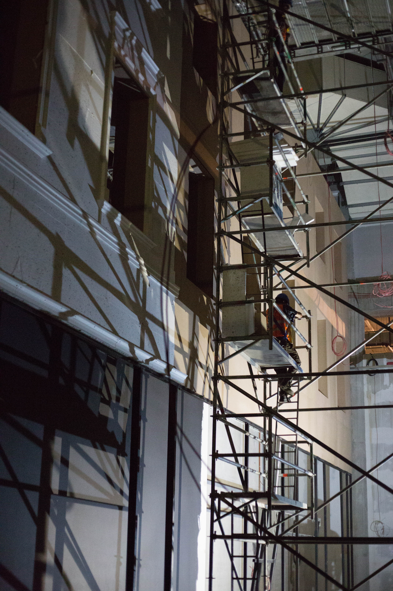
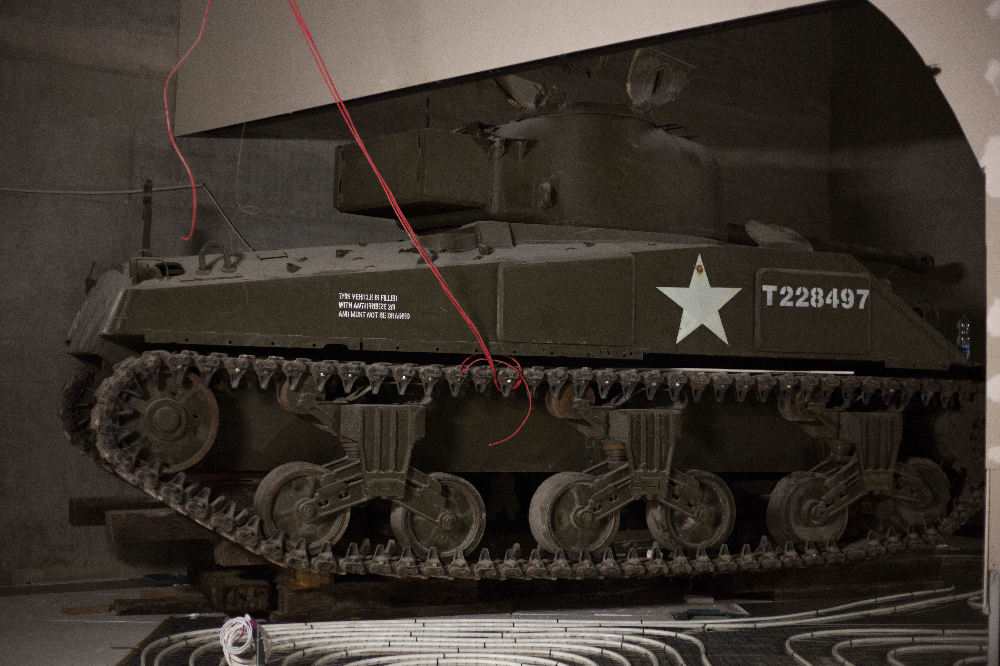

World War Two Museum in Gdansk (Under Construction)
==========

We had an amazing opprotunity to visit the still unopened Second World War museum in Gdansk.
While the building is still under construction and so no exhibits are on display, our guide was the director of the musuem and was able to share with us what the plans for each segment are.
The whole museum layout is decided, and many the artifacts were available for us to see afterwards.

The Gdansk World War Two Museum is somewhat unique in its approach to portraying history.
Instead of focusing on military battles and a birds eye view of the war, the museum centers on the human experience throughout Europe.
Life before, during, and after the war will be portrayed in exhibits throughout the museum.
In one hall, we saw the construction of a facade to resemble Warsaw's streets antebellum.

<figure class="figure">
  
  <figcaption class="figure-caption text-right">The streets of Warsaw.</figcaption>
</figure>

Controversially, the museum does not plan to turn a blind eye from the Poles implicated in violence during the war.
The evidence of the massacre at Jedwabne will be shown, with acknowledgment that not all attrocities were commited by Germans.

One exhibit is partially constructed, an American tank was installed in advance of the completion of the area (likely due to the difficulty of moving a tank around a fully constructed museum).

<figure class="figure">
  
  <figcaption class="figure-caption text-right">An American Tank.</figcaption>
</figure>

The tour of the museum showed me how much thought goes into the layout and overall experience of a new museum.
The museum director's knowledge of every room and its future contents impressed me -- it was clear that much thought had gone into every aspect.